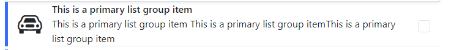

# List Item

## Main Points

### List Item Props:

```js
interface IListItem {
  item: {
    title: string,
    actionIcon?: string,
    avatar?: string,
    labelColor?: string,
    description?: string,
    sub_description?: string,
    icon?: string,
  };
}
```

### UI:

- default list item UI

  

- list item with description

  

- list item with sub description

  

- list item with avatar image

  

- list item with action icon

  

- list item with icon start

  

## How v-list-item works

the list item component is responsible for item ui.
takes a props as obj with title required.
other object values are optional, there are slot tags for `icon` `avatar` `description` `sub-description` and `action`, and they will be activated if the obj contains the key representing the slot
