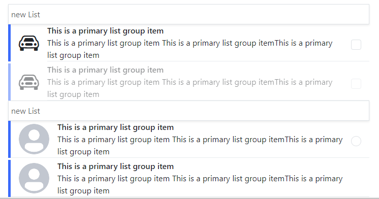

# List Item

## Main Points

### List Item Props:

```js
interface IListItem {
  title: string;
  actionIcon?: string;
  avatar?: string;
  labelColor?: string;
  description?: string;
  sub_description?: string;
  icon?: string;
}
interface IListItemProps {
  item: IListItem;
}
interface IListGroupProps {
  item: {
    list: IListItem[],
    header: string,
  };
}
interface IListViewProps {
  listGroup: {
    list: IListItem[],
    header: string,
  }[];
}
```

### UI:

- default list item UI

  

- list item with description

  

- list item with sub description

  

- list item with avatar image

  

- list item with action icon

  

- list item with icon start

  

- list view group of items with list header

  

- disabled list item

  

## How v-list-item works

the list item component is responsible for item ui.
takes a props as obj with title required.
other object values are optional, there are slot tags for `icon` `avatar` `description` `sub-description` and `action`, and they will be activated if the obj contains the key representing the slot.

list view and list group components are responsible of display multiple list item UI

## How v-list-item action works

by passing a component vue tag as an `action` slot, and determining which action vue component should appear in the list item using enum and collection of vue components as shown below

```js


   <template #action="{ item }">
      <component
        v-if="item?.action"
        :item="item"
        :is="listItemActions[item?.action]"
      ></component>
    </template>
    <script>
    enum ListItemAction {
      VCheckbox = 1,
      VCRadio = 2,
    }

    const listItemActions: { [key: string]: ComponentOptionsMixin } = {
      [ListItemAction.VCheckbox]: VCheckbox,
      [ListItemAction.VCRadio]: VRadio,
    };
    </script>
```
