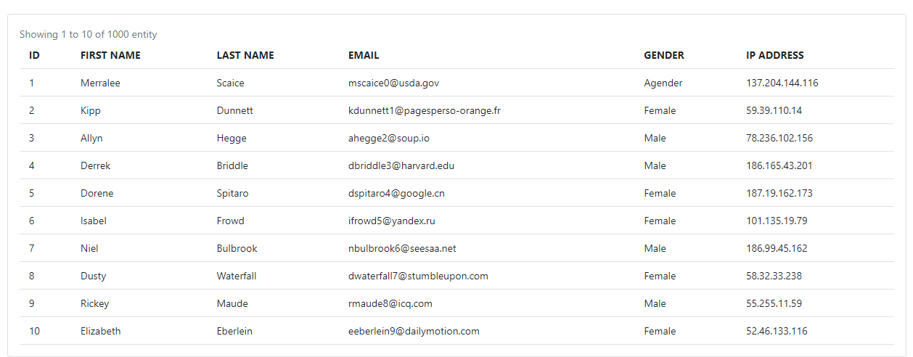
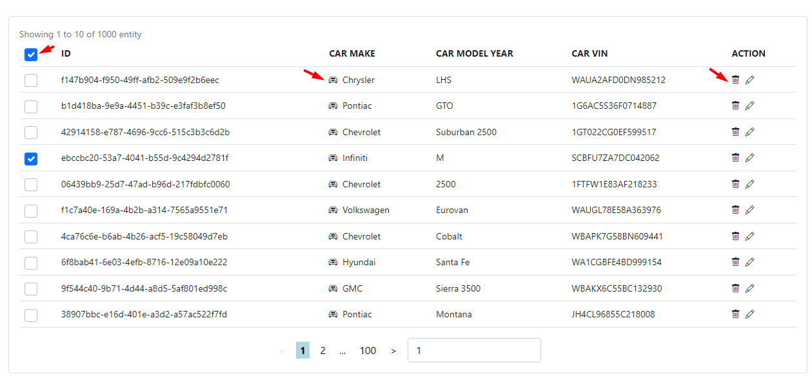

# Table

## Main Points

### Table Props:

```js
type ColumnSchemaType = {
  displayName: string, // for the th content
  name: string, // for the cell content key `it is possible to access nested object value => user.name.first-name`
  slotName?: string, // if we want to pass a component in one of the table cells
  displaySlot?: string, // if we want to pass a component in one of the headers
};
interface ISchema {
  columns: ColumnSchemaType[]; // array of columns represent each table col
}
interface ITableProps {
  schema: ISchema; // schema is the table configuration
  data: { [key: string]: any }[]; // table data as an array of object
  currentPage: number; // the current page of table
  rowsPerPage: number; // how many row in page as number
}
```

### UI:

- default UI

  

- with slots `component inside cell`

  

  > show input by passing "withInput" true

## How v-table works

The table uses the schema to configure the table cols and headers and determine which column/header will display a component instead of text.
we can access the row data when passing a slot component to make easy access to the data
the slot is dynamic for ex: we can choose the slot name from schema so when we pass the component we will take the same slot name from schema, this way we can be sure that the component will be in the same position we want.

The Table listens to any change from the pagination component whenever the current page changes the table takes action and represents the data depending on the new page
